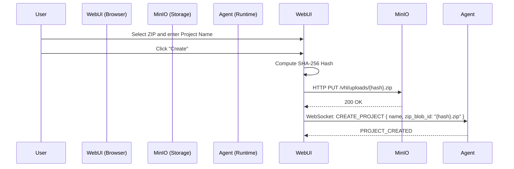

# ZIP File Upload Implementation Documentation

This document describes the implementation of the ZIP file upload feature in the `vhl-webui` during the project creation phase.

## Feature Overview

The feature allows users to select a ZIP file from their local machine when creating a new project. The WebUI handles the following:
1. **Hashing**: Generates a SHA-256 hash of the ZIP file.
2. **Uploading**: Uploads the file to the MinIO object store using the hash as the unique identifier.
3. **Project Creation**: Includes the resulting `zip_blob_id` in the `CREATE_PROJECT` WebSocket message sent to the agent.

---

## Technical Implementation Details

### 1. Resolving Node.js Dependency Issues

Initially, an attempt was made to use the official `minio` JavaScript SDK in the browser to handle authenticated uploads. However, this led to build failures in Vite because the `minio` SDK depends on several Node.js built-in modules (e.g., `fs`, `stream`, `util`, `crypto`) that are not available in a standard browser environment.

**Resolution:**
Instead of polyfilling the entire Node.js environment into the browser (which would significantly bloat the bundle and introduce complexity), we shifted to a **lightweight fetch-based approach**:
- **Direct HTTP PUT**: We use the standard browser `fetch` API to perform an HTTP `PUT` request directly to the MinIO endpoint.
- **Infrastructure Alignment**: To avoid the complexity of S3 V4 request signing in the browser, we updated the MinIO bucket policy in `docker-compose.yml` to allow anonymous uploads specifically to the `uploads/` directory. This aligns with the "Development Environment" philosophy of the VHL system.

### 2. File and Logic Updates

#### `vhl-webui/lib/utils/objectStorageBrowser.ts` (NEW)
- **Purpose**: Provides the core logic for hashing and uploading files from the browser.
- **Key Functions**:
    - `computeFileHash(file: File)`: Uses `crypto.subtle.digest` to generate a SHA-256 hash string.
    - `MinioBrowserClient.uploadFile(file: File, objectKey: string)`: Handles the `fetch` request to upload the blob.

#### `vhl-webui/lib/components/ChatInterface/components/ProjectInitializationMenu.tsx` (MODIFIED)
- **Purpose**: Updates the project creation UI.
- **Changes**: Added a "Project ZIP (Optional)" section with a hidden file input and a custom "Upload ZIP" label. It also automatically populates the project name from the zip filename if the input is empty.

#### `vhl-webui/lib/components/ChatInterface/ChatInterface.tsx` (MODIFIED)
- **Purpose**: Orchestrates the upload flow.
- **Changes**: Updated `handleCreateProject` to be an `async` function. It now intercepts the "Create" action, performs the hash and upload steps if a file is selected, and then dispatches the `CREATE_PROJECT` WebSocket message with the `zip_blob_id`.

#### `vhl-runtime/docker-compose.yml` (MODIFIED)
- **Purpose**: Configures the storage backend to support the new WebUI feature.
- **Changes**: Changed the `minio-init` policy from `public` (read-only) to `anonymous set upload` for the `/uploads` path. This is critical for allowing the browser to write files to the object store without pre-shared secret keys.

---

## Upload Flow Diagram

## Security Considerations (Dev Environment)
In this implementation, MinIO allows anonymous uploads to the `/uploads` directory. While suitable for local development and controlled laboratory environments, a production deployment would typically replace this with **S3 Pre-signed URLs** generated by the backend to ensure authenticated and time-limited upload permissions.
